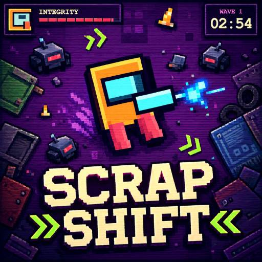
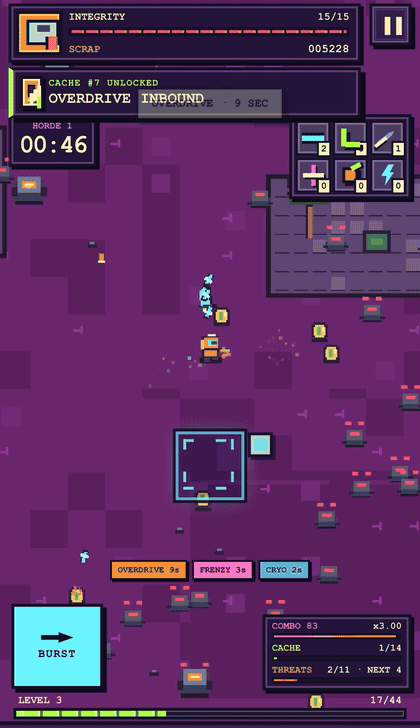

# SCRAP//SHIFT




SCRAP//SHIFT is an endless pixel-art arena survival game built for
[RUN.world](https://run.world/). It plays in portrait and landscape, supports
touch and keyboard controls, and uses PixiJS 8 with a WebGPU-first renderer and
WebGL fallback.

[Play SCRAP//SHIFT on RUN](https://w.run/lonu/scrapshift)



## Highlights

- Endless, infinitely streaming scrapyard with violet, rust, toxic, and steel
  terrain regions.
- Eleven enemy families that unlock with character level and use distinct
  movement, projectile, mine, charge, split, and pulse attacks.
- Periodic warned hordes that interrupt ordinary spawn pressure.
- Six weapon families and fourteen upgrade lines.
- A Blade Carousel that grows from one to eight rotating pixel swords, each
  with its own silhouette and palette.
- Eight collectible powerups rendered as embedded bitmap-art cards.
- Rare treasure discoveries, cache rewards, combos, daily drops, cosmetic
  pilots, and permanent records.
- Touch-first floating-stick movement: hold anywhere, drag to steer, and
  release to stop.
- Responsive portrait and landscape HUDs with RUN safe-area handling.
- Persisted music, SFX, haptic, reduced-motion, and performance-counter
  settings.
- Player-facing RUN Shop offers and carefully capped results-screen ads.
  Purchases are cosmetic or remove mandatory interstitials; they never add
  combat power.

## Controls

| Action | Touch | Keyboard |
| --- | --- | --- |
| Move | Hold anywhere and drag around the touch origin | WASD or arrow keys |
| Stop | Release the active touch | Release movement keys |
| Burst | Tap `BURST` | Space |
| Pause | Tap the pause button | Use the on-screen pause button |

Weapons target automatically. Positioning, Burst timing, pickup routing, and
upgrade choices carry the skill expression.

## Development

Requirements:

- Node.js 22 or newer
- npm

Install and run locally:

```sh
npm ci
npm run dev
```

The regular development server uses the safe local fallback. Host-backed
storage, Shop, Entitlements, ads, analytics, and native haptics require the RUN
host or the opt-in RUN Playground:

```sh
npm run dev:playground
```

Playground purchases are real and persistent. Never confirm a purchase without
an approved test account and budget.

## Verification

Run the complete local gate:

```sh
npm run check
```

Useful individual commands:

```sh
npm run typecheck
npm run lint
npm run simulate
npm run build
```

The deterministic simulation covers pause/resume, seeded combat, upgrade flow,
all eight Blade Carousel levels, endless coordinates, level-gated enemies,
hordes, treasure cadence, touch release-to-stop, monetization fail-closed
behavior, and terminal results.

The development-only browser contract is enabled with `?qa=1`.
`scripts/visual-qa.mjs` captures both orientations and exercises automatic
WebGPU selection plus forced WebGPU and WebGL stress paths.

## Project structure

```text
src/game/       deterministic simulation, Pixi scene, procedural pixel art
src/ui/         DOM HUD, menus, cards, touch controls, performance overlay
src/systems/    saves, daily rewards, cosmetics, Shop, ads, LiveOps
src/sdk/        bounded RUN SDK facade and safe-area conversion
src/audio/      music lifecycle and procedural SFX
scripts/        simulation, schema, build, and browser QA checks
rundot/         reviewed Shop and LiveOps source configuration
docs/           design, monetization, audio, measurement, and art direction
```

The production build uses relative asset URLs and writes to `dist/`.
`game.config.prod.json` declares both-orientation RUN metadata.

## Monetization policy

Every weapon, enemy, upgrade, record, and standard run is available without a
purchase or ad.

- The Foundry + Void pack and Founder Bundle contain visual pilot/blade
  palettes only.
- Ad-Free Forever permanently removes mandatory results-break interstitials.
- Rewarded videos are optional and grant a clearly stated salvage bonus only
  after host-confirmed completion.
- There are no banner, launch, pause, upgrade, or mid-run ads.
- The public LiveOps configuration disables the private monetization diagnostic
  bay.

The exact products, RB launch prices, eligibility, caps, exclusions, and
rollback rules are documented in [docs/monetization.md](docs/monetization.md).

## License

Repository-owned materials are distributed under the
[RUN Repository Supplemental License v1.0](LICENSE.md). Before January 1, 2028,
the licensed template-derived materials are limited to RUN-platform use. On the
change date, covered materials convert to the MIT License under the terms in
`LICENSE.md`.

Third-party packages retain their own licenses. The supplied
`scrapyard-loop.mp3` recording is not granted additional rights by the
repository license; review [THIRD_PARTY_NOTICES.md](THIRD_PARTY_NOTICES.md)
before redistributing it.

## Contributing

Contributions must comply with `LICENSE.md`, preserve third-party notices, and
contain no credentials, player snapshots, private campaign state, or generated
build output.
